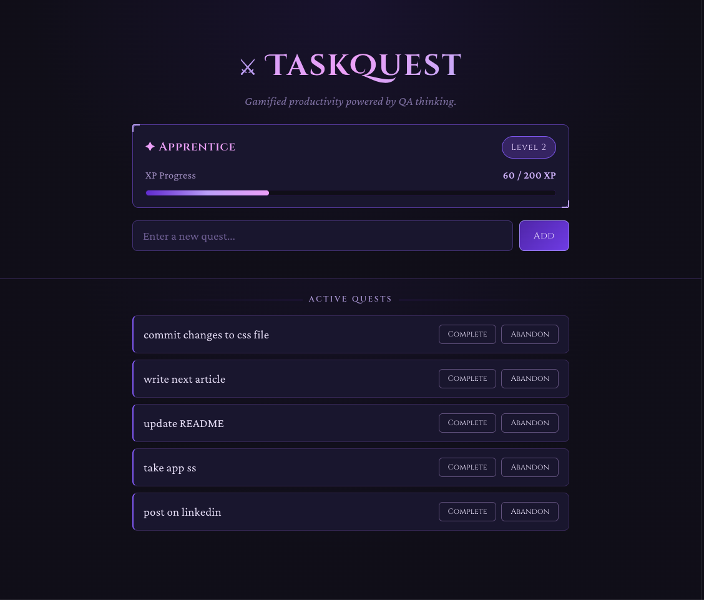
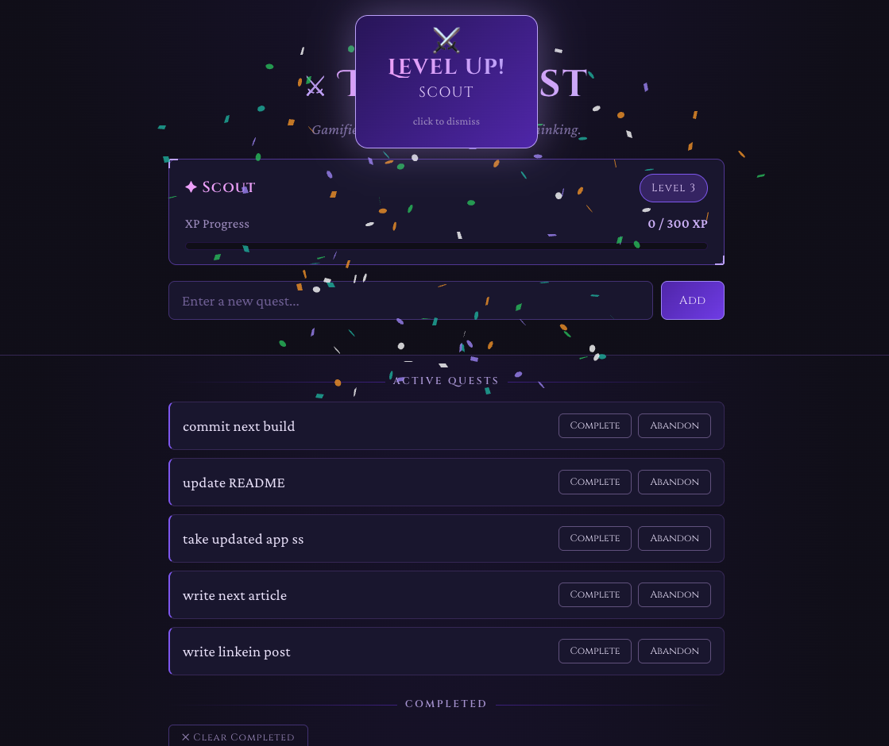
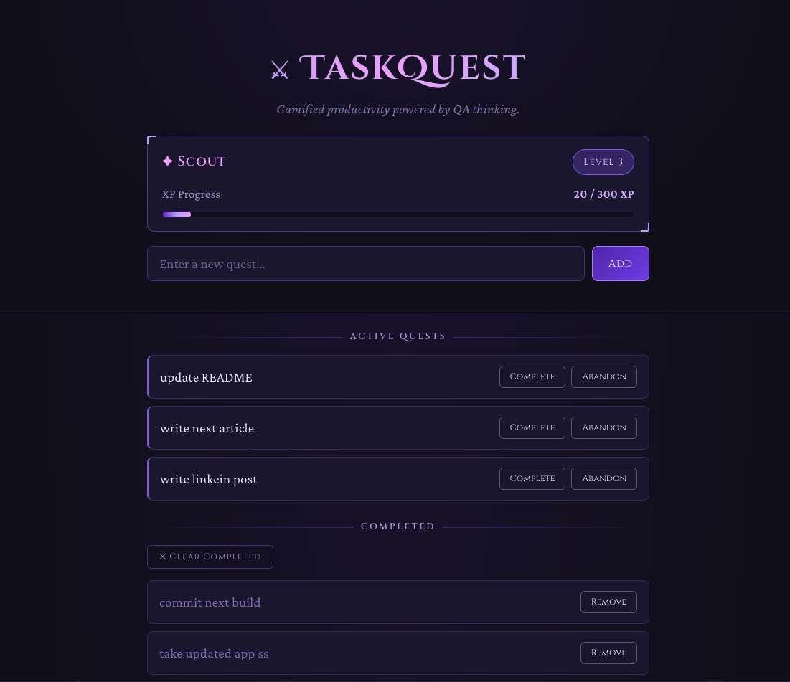
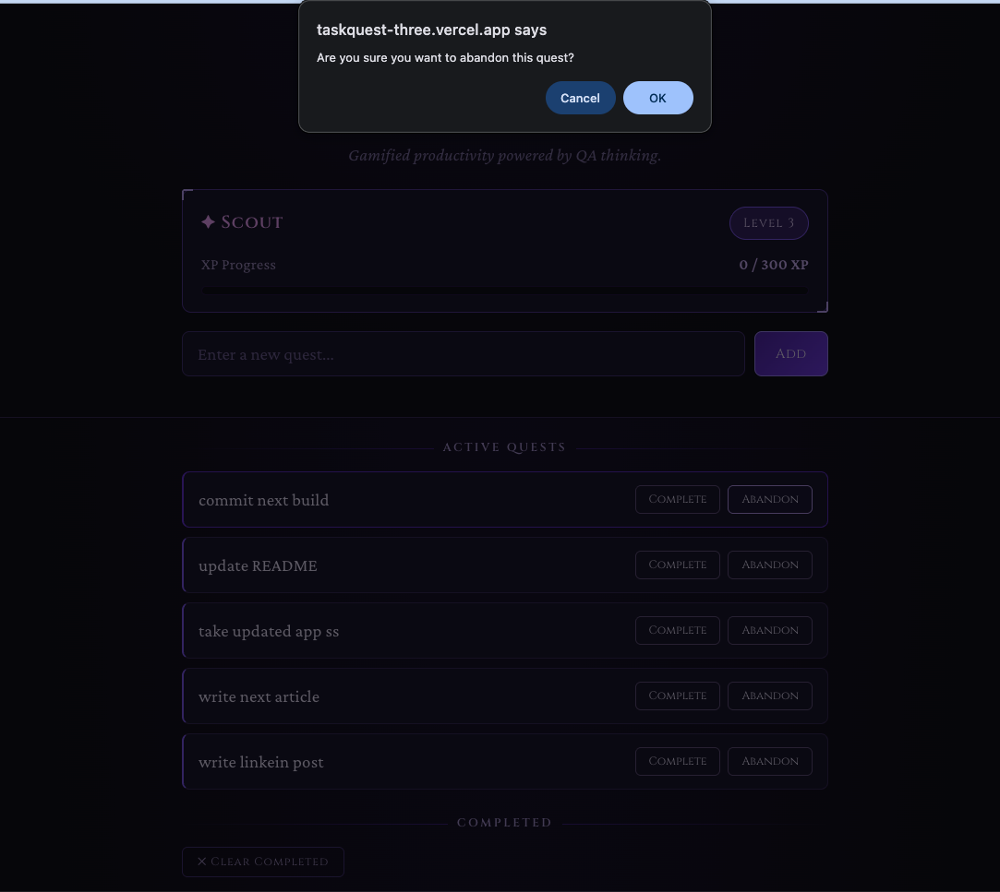
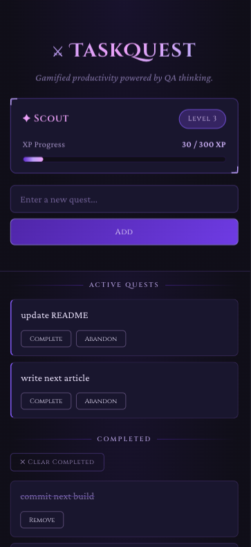

# TaskQuest ⚔️

A gamified productivity app built with React, inspired by RPG quest systems. Manage your tasks as quests, earn XP for completing them, level up through ranks from Newcomer to Legend, and conquer your day — one commit at a time.

---

## Live Demo

🔗 [taskquest-three.vercel.app](https://taskquest-three.vercel.app)

---

## Screenshots

### Desktop

| Active quests with XP progress                                 | Level-up celebration                                             | Completed quests                                              |
| -------------------------------------------------------------- | ---------------------------------------------------------------- | ------------------------------------------------------------- |
|  |  |  |

**Confirmation dialogs — destructive action protection**



### Mobile



---

## The Idea

TaskQuest grew out of a question I kept asking while building React apps: _What would a to-do list feel like if it was designed by a game studio?_

The UI borrows from RPG quest logs — tasks become quests, completions earn XP, and your progress persists between sessions. The first version proved the concept but the reward loop was incomplete: the XP bar filled up and nothing happened. That gap became the starting point for a deeper upgrade — a full leveling system, player titles, and a fantasy-themed redesign.

Beneath the aesthetic, the real design driver throughout has been QA thinking: every input, action, and state transition considered from the perspective of how it could break or frustrate a user.

---

## Features

- **Leveling system** with increasing XP thresholds (`level × 100` XP per level) — early levels come fast, later levels feel earned
- **Player title progression** — Newcomer → Apprentice → Scout → Adventurer → Warrior → Champion → Legend
- **Level-up celebration** — animated banner with confetti, auto-dismisses after 2.5s or on click
- **Quest creation** with input validation — empty submissions are blocked
- **Smart duplicate detection** — blocks duplicate active quests, but allows re-adding a quest once the existing one is completed (supports recurring tasks)
- **Auto-sorting** — completed quests move to the bottom, keeping active quests in focus
- **Sticky header** — XP bar and quest input stay fixed while the quest list scrolls
- **Enter key support** — submit a quest without reaching for the mouse
- **Bulk clear completed** — remove all completed quests at once, with confirmation
- **Context-aware confirmations** — distinct confirmation messages for abandoning an active quest vs. removing a completed one
- **Persistent state** via `localStorage` — progress survives page refreshes
- **Fantasy RPG UI** — Jewel Purple theme with Cinzel typography, gradient title, corner-bracketed panels, and a fully responsive layout

---

## Tech Stack

| Layer       | Technology                                                             |
| ----------- | ---------------------------------------------------------------------- |
| Framework   | React (Vite)                                                           |
| State       | React Hooks (`useState`, `useEffect`) + custom hook (`useLevelSystem`) |
| Persistence | `localStorage`                                                         |
| Animation   | `canvas-confetti`                                                      |
| Styling     | Plain CSS (custom properties, flexbox, responsive, Google Fonts)       |
| Deployment  | Vercel                                                                 |

---

## Getting Started

```bash
# Clone the repository
git clone https://github.com/Yogita-96/taskquest.git
cd taskquest

# Install dependencies
npm install

# Start the development server
npm run dev
```

App runs at `http://localhost:5173`

---

## Project Structure

```
taskquest/
├── public/
├── src/
│   ├── hooks/
│   │   └── useLevelSystem.js   # XP calculation, level thresholds, title mapping
│   ├── App.jsx                 # Root component — quest state, logic, UI
│   ├── App.css                 # Fantasy RPG theme (Jewel Purple), layout, animations
│   └── index.css               # Global resets and base styles
├── package.json
└── README.md
```

---

## Implementation Notes

A few deliberate decisions worth noting:

- **Custom hook for XP logic** — `useLevelSystem` isolates all leveling logic (level calculation, title mapping, level-up detection) away from `App.jsx`, keeping concerns separated and the logic independently reusable
- **Increasing XP thresholds** — `level × 100` XP required per level, calculated by walking up levels until total XP fits the current one. Rewards early momentum while making higher levels feel earned
- **Lazy state initializers** — `quests` and the hook's XP state read from `localStorage` on first render only, using the `useState(() => ...)` initializer pattern to avoid re-reading on every render
- **Smart duplicate check** — only blocks a duplicate if the existing quest with the same name is still active; completed quests don't block re-adding, supporting recurring tasks like "Go for a walk"
- **Context-aware `window.confirm`** — the confirmation message changes depending on whether a quest is being abandoned (active) or removed (completed), keeping the language accurate to the action
- **Single `useEffect` per concern** — quests sync to `localStorage` in one effect, XP syncs in another inside the hook, keeping persistence logic predictable and easy to trace

---

This project was deliberately built with **QA-first thinking** applied to frontend development:

- **Expect unexpected input** — validate before processing
- **Protect state consistency** — catch duplicates before they cause confusion, but don't over-restrict legitimate use cases
- **Make destructive actions reversible (or at least confirmed)** — confirm before deleting, and make sure the confirmation language matches the actual consequence
- **Respect continuity** — users shouldn't lose progress on refresh
- **Make feedback feel real** — a reward system without visible payoff (the original flat XP bar) technically works but fails the user experience

These aren't just React best practices. They're lessons from functional QA work on shipped game titles, applied to the product layer of a web app.

---

## Read the Full Story

This project is documented across an ongoing Medium series on what game QA taught me about building better software:

1. [What Game QA Taught Me About Writing Better Software](https://medium.com/@yogita27496/what-game-qa-taught-me-about-writing-better-software-f4fd96cbe02b)
2. [7 QA Mindsets Every Frontend Developer Should Learn](https://medium.com/@yogita27496/7-qa-mindsets-every-frontend-developer-should-learn-ff84a42d664f)
3. [How I Added Gamification to a Simple To-Do App](#) — coming soon

---

## About the Author

Frontend developer with a background in game FQA (Ubisoft, Bandai Namco titles via Globalstep). Currently building in React while exploring game development with Unity and Unreal Engine.

- 🌐 Portfolio: [Currently in works]
- 💼 LinkedIn: [Yogitaa M.](https://www.linkedin.com/in/yogita-m/)
- 🎮 MobyGames: [Yogita Yogita](https://www.mobygames.com/person/1835643/yogita-yogita/)
- ✍️ Medium: [@yogita27496](https://medium.com/@yogita27496)

---

## License

MIT
